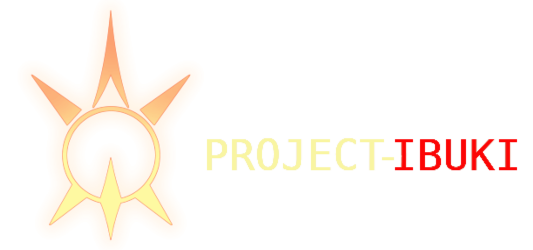
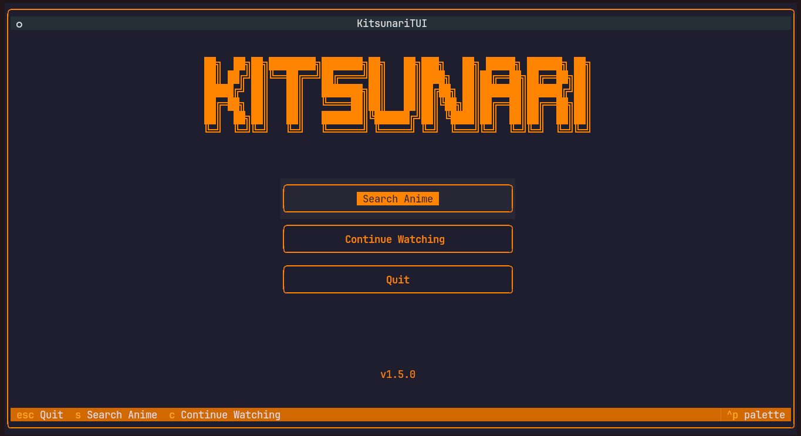
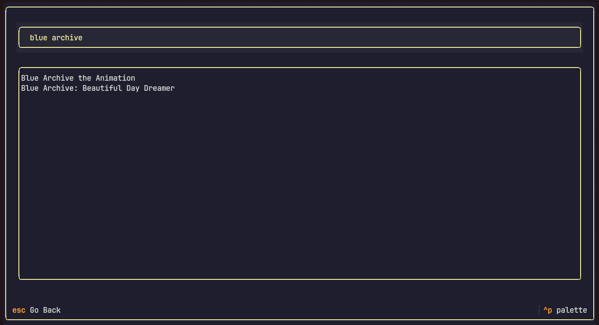
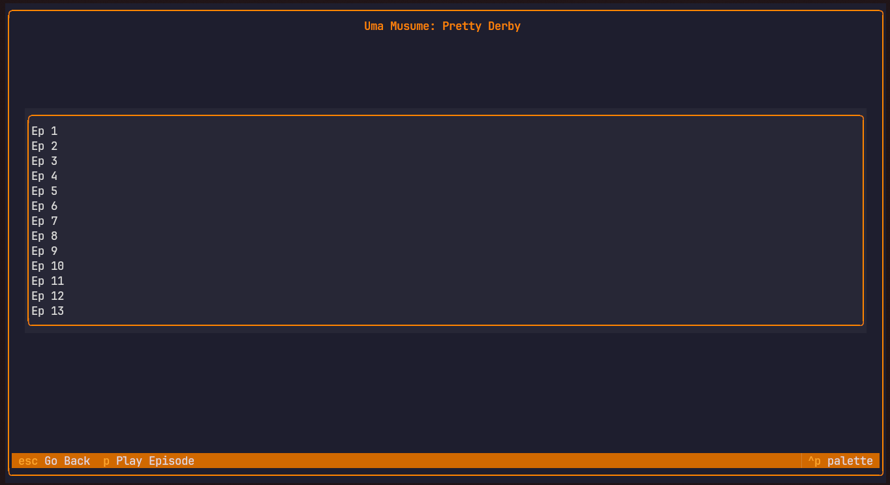

\


**Modern Terminal UI for anime streaming**
A sleek, interactive TUI application for browsing and watching anime, powered by a custom backend built on `anipy-api` and Textual.
Cross-platform version planned for future release.

---

## Features

* **Rich Terminal Interface** – Interactive TUI with mouse support
* **Reliable Backend** – Fast-ish synchronous anime fetching using `anipy-api`
* **Modern UX** – Browse anime with panels, tabs, and real-time updates
* **Episode Management** – Queue episodes, track progress*, seamless playback
* **Fast Releases** – Quickly access the latest anime releases

---

## Installation
```bash
git clone https://github.com/XeonXE534/Project-Ibuki.git
cd Project-Ibuki

bash ./install.sh
```

After installation, you can run Project-Ibuki anywhere using:
`ibuki`

## Requirements

* **Python 3.10+**
* **Anipy-api**
* **Textual**
* **MPV**

---

## Screenshots






---

## Roadmap

* [x] ~~CLI-based anime streaming~~ → **TUI Implementation**
* [x] Enhanced episode browsing and search
* [x] Watch history
* [x] User preferences
* [ ] Cross-platform distribution

---

## Notes

- Some minor bugs may exist (search, playback)
- Only Linux fully supported 
- MPV must be installed and available in your PATH for playback.
- This version uses `backend_v3` which is the stable backend.
- Check out the `test_branch` branch for the unstable beta backend (NOT RECOMMENDED FOR DAILY USE, UNSTABLE)
---

## Contributing

Contributions welcome!
Fork, tweak, and submit PRs, any improvements are welcome.

---

## License

GPL 3.0 – see LICENSE file for details

## Credits
- Backend: [Anipy](https://github.com/sdaqo/anipy-cli)
- UI: [Textual](https://github.com/textualize/textual/)

*Built with ❤️ for the anime community*

---

## Disclaimer

Project-Ibuki is an independent, open-source project and is not affiliated with, endorsed, or sponsored by Nexon Games, Yostar, or Blue Archive.
The character Ibuki and related assets belong to Nexon Games Co., Ltd.
All character references are for fan and educational purposes only.

If you are a copyright holder and believe any content used here violates your rights, please open an issue or contact me — I'll remove it immediately.